# Introduction:

The website I built is a dynamic website. The name of the website is
RealEstateBD.com. It is a website where we can buy or rent any property
or submit our own property. When an user comes to the website, he can
see the list of the properties for Sale and Rent. He can see details of
these property buy clicking to details button in the card view. Each
property is also given with the number a handler at the bottom, in case
the user want to buy or rent this property.

The user can also submit his own property but have to be logged in
first. There is also an admin page where all the user’s list and
property lists are handled.

To build this website, HTML, CSS, JavaScript, JQUERY and BOOTSTRAP was
used as frontend language and PHP was used as backend language. We also
used MySQL database management system to store and manipulate data.
XAMPP web server was used for PHP and MySQL.
# FlowChart:

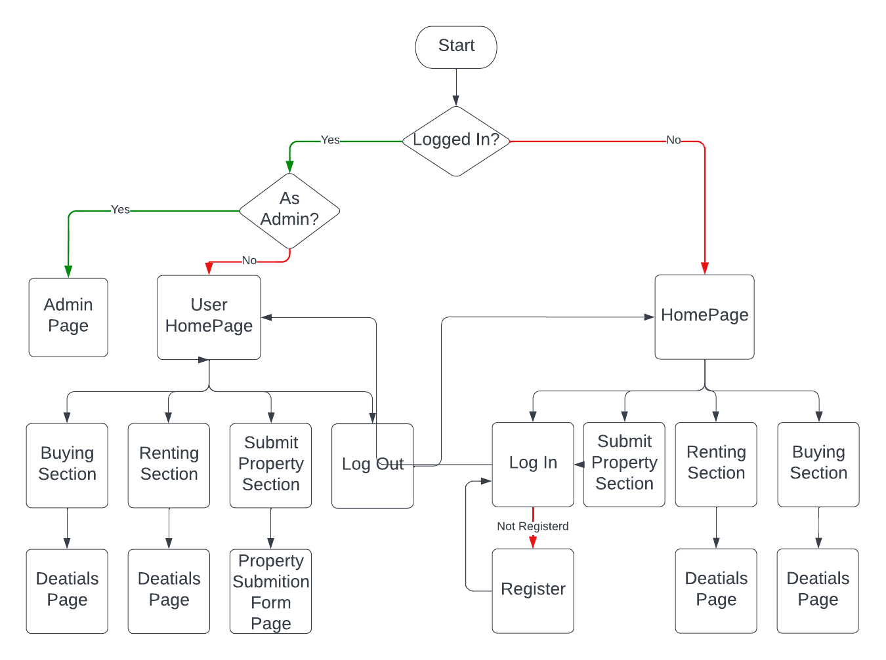

# Detailed Visualization:

## Home Page:
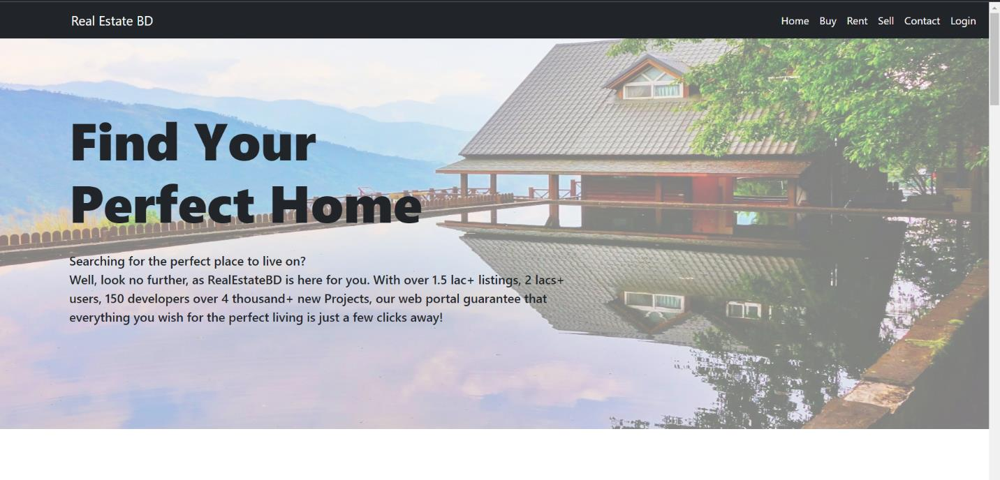

 

## Login Page:

> 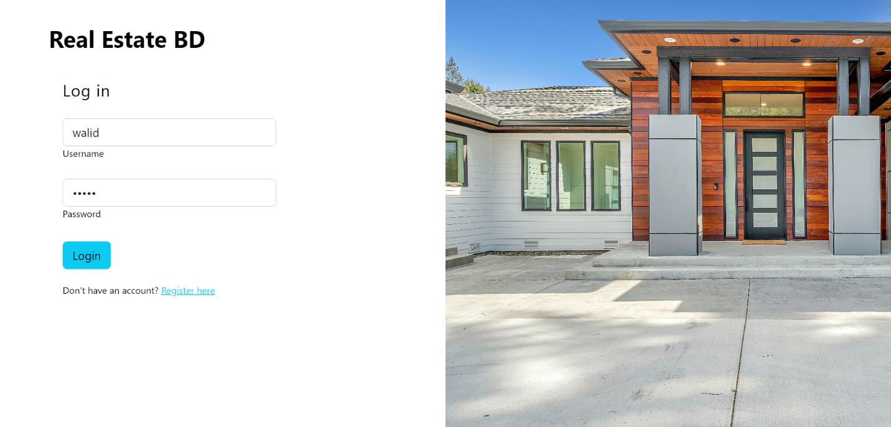

## Sign Up Page:

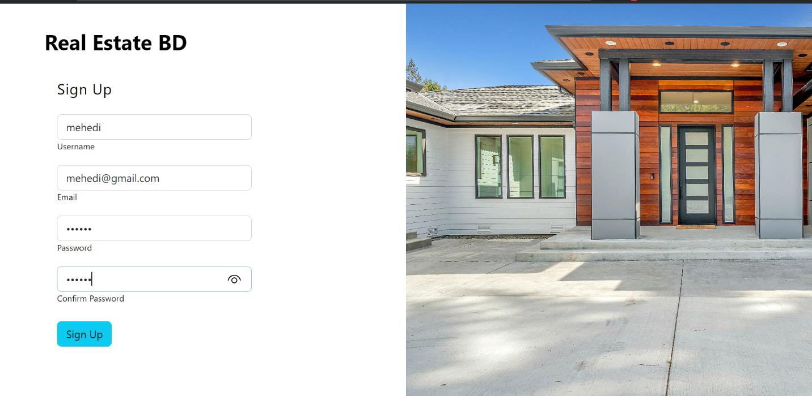

## Home Page After Log in:

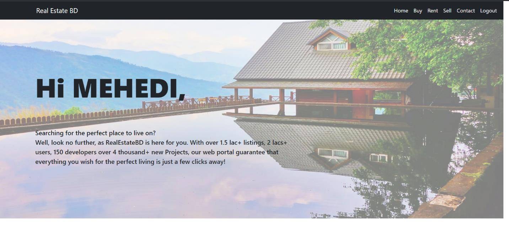

## Buy Section:

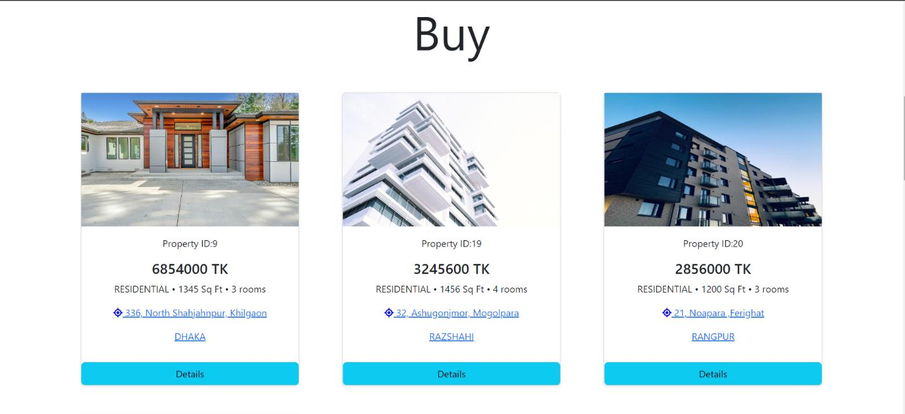

## Rent Section:

> 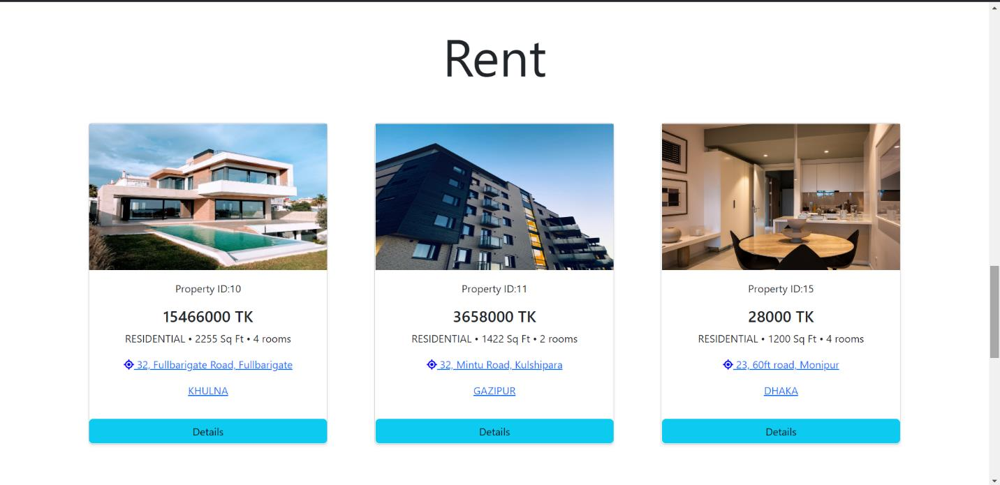

## Details Page:

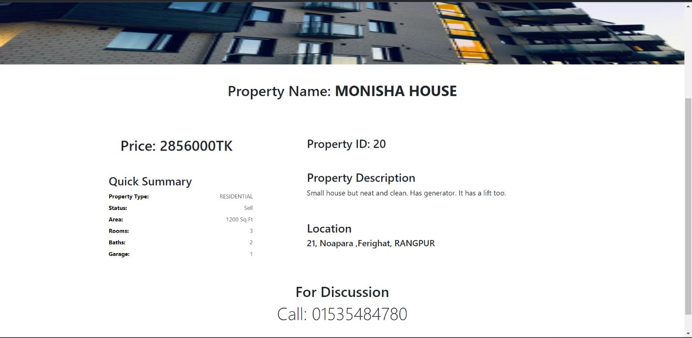

## Submit Property Section:

> 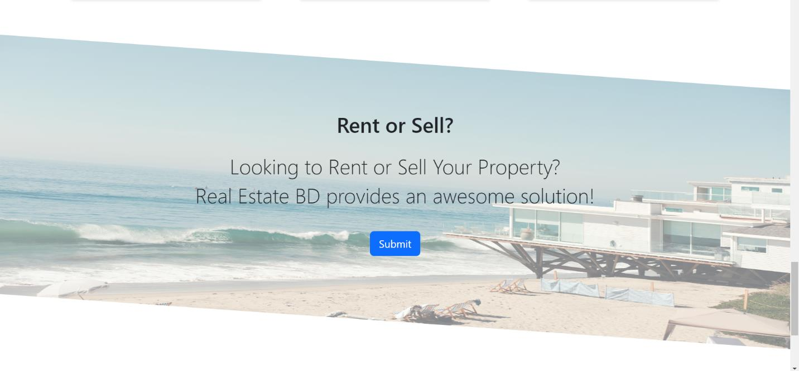

## Submit Property Form:

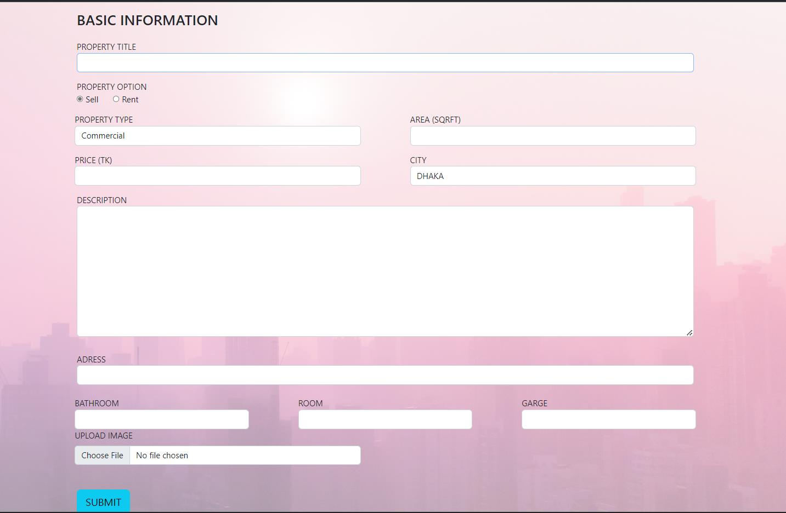

## Giving admin’s info in login page:

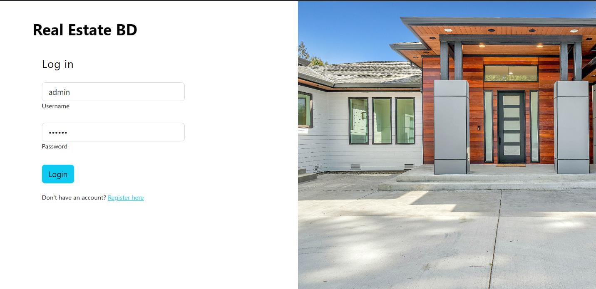

## Admin Page:

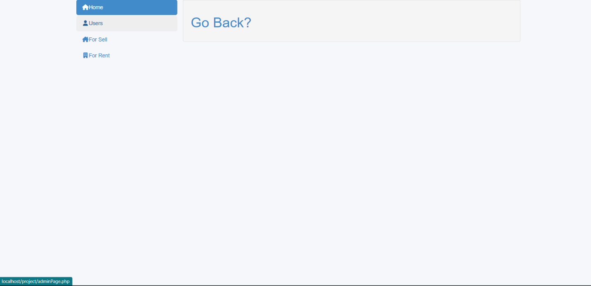

## User’sList in Admin Page:

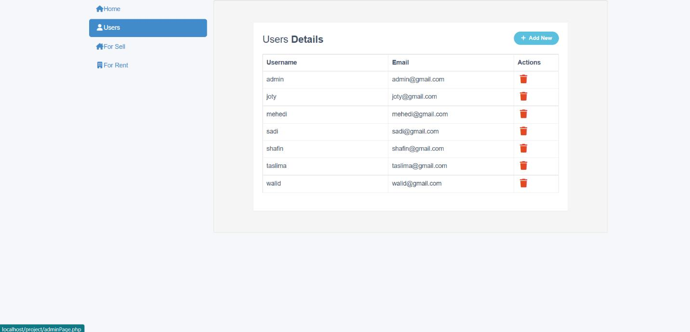

## Can Add or Delete User:

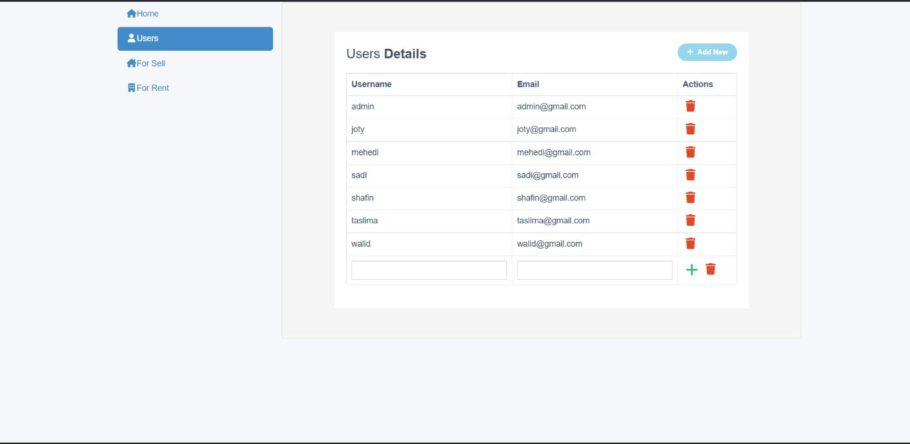

## Properties for sell List:

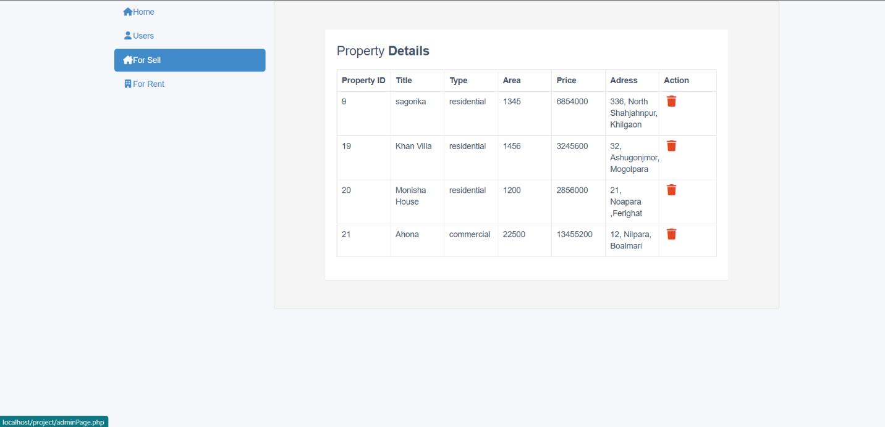

## Properties for Rent List:

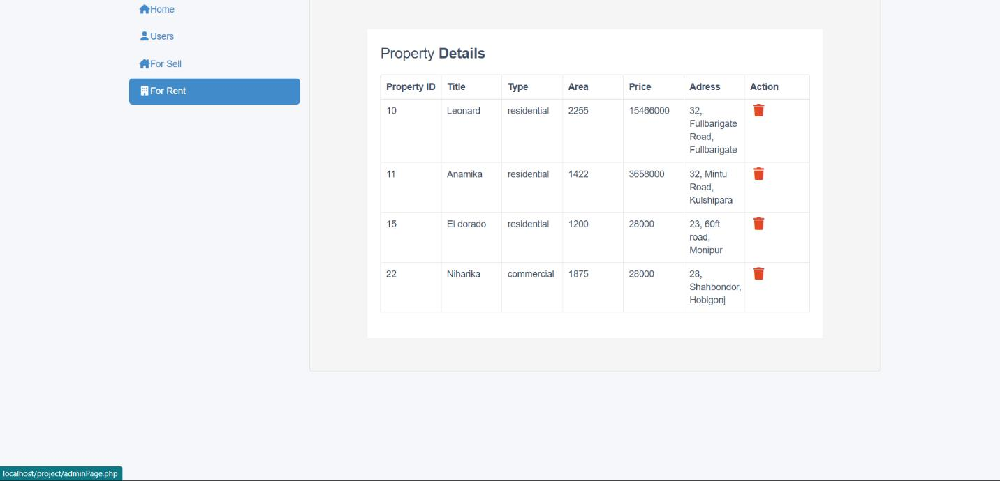

## Target vs Actual Accomplishments:

In this website, I wanted to build a more user friendly UI. My target
was to add animation and make the website more dynamic which I wasn’t
able to do. There are other minor problems as well. The targeted website
included a search option for properties, which can search properties by
its address.

But at the end I am satisfied with the website. It might have lacking
but it is enough to satisfy the users.

## Implementations: 

At the very top of the website there is a Navbar. The navbar has logo at
the left most corner, following by Home, Buy, Rent, Contact, and Login.
Buy clicking to Home he can return to homepage, can go to rent section

buy clicking to Rent, Buy section by Buy, Submit Property page buy Sell
and Contact section buy Contact. The Buy section contains card list of
all the properties which are submitted for sale. The Rent section
contains card list of all the properties which are submitted for Rent.
An user also go to the details page buy clicking Details button. The
details page contains picture of the property, property name,
description, location, price and others important details. For
interested user’s, the number of handler is given at the bottom.

By clicking at the Sell button, he can go to submit Property page. But
the user must log into the website first. He can traverse to log in page
buy clicking log in option from the navbar. If the user is not
registered, he can register buy clicking to register now link. Then he
can log in by submitting his username and password. At the submit
property page, there is form at which the user must submit detailed
information about his property. He can also submit picture of his
property. After submitting the form, his property will show up at the
homepage.

There is also an Admin page. When the admin log in with his username and
password, he will be transferred to admin page. There are user list and
property list. Admin can add or delete any user. He can also delete any
property from the database. So if any property is sold or the user want
to remove it from the website, the admin can do it. With all this
implementation the website run perfectly.

## Schema Diagram:

The design of the database is called schema and more formally it means
the structural view of the database .A database schema defines how the
data is organized using the schema diagram.

In this project 2 tables are used under a database where various
information is stored. The schema diagram is given below

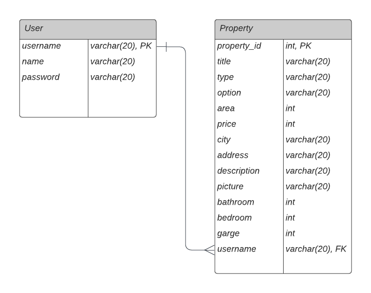
